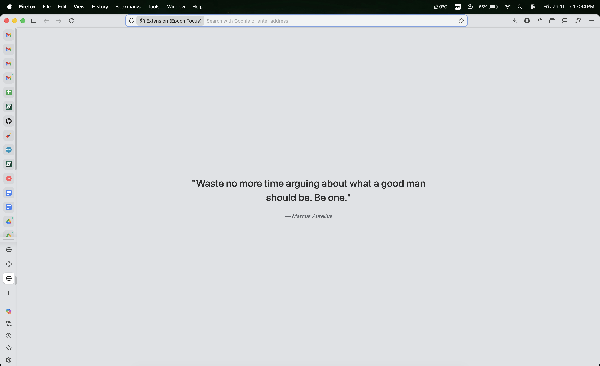
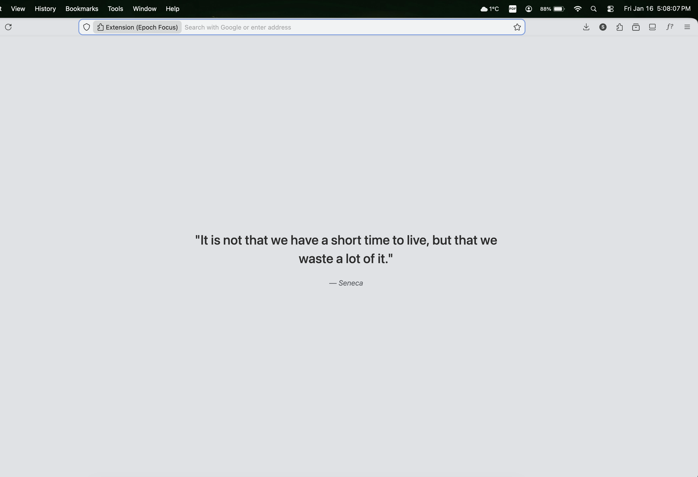

# Epoch Focus

**Epoch Focus** is a zero-latency "New Tab" override for Firefox. It replaces the noisy default homepage with a minimalist grey canvas and a single piece of Stoic wisdom.

Part of the **Epoch Suite** by [TheCSJourney](https://thecsjourney.com).

![Epoch Focus Screenshot]
- 
- 
- 

## The Philosophy
Standard "New Tab" extensions often load heavy frameworks (React/Vue) or fetch data from remote APIs, introducing 500ms+ latency.
Epoch Focus is engineered for **speed**:
- **0ms Network Latency:** Quotes are bundled locally.
- **0ms Render Block:** No external frameworks, just Vanilla JS.
- **System Fonts:** No web-font loading shift.

## Features
- **Stoic Database:** A hand-curated collection of Stoic and Eastern wisdom.
- **Theme Match:** Perfectly aligns with the `Epoch Light` browser theme (`#E0E2E5`).
- **Privacy First:** No tracking, no analytics, no permissions required beyond storage.

## Installation
1. Download the latest release from [Releases](../../releases)
2. Go to `about:addons` -> ⚙️ -> **Install Add-on From File**.
3. Select the `.zip` file.

## Mozilla Store
- The theme is currently in review in the Mozilla store and would be available soon

## Development
This project treats the extension as a software artifact.

**Requirements:**
- Python 3.12+ (for build tools)
- `uv` (for dependency management)

**Build Assets:**
```bash
# Generate high-fidelity icons using Lanczos resampling
uv run tools/generate_icons.py

---
*Built by [Sumit Nautiyal](https://thecsjourney.com)*