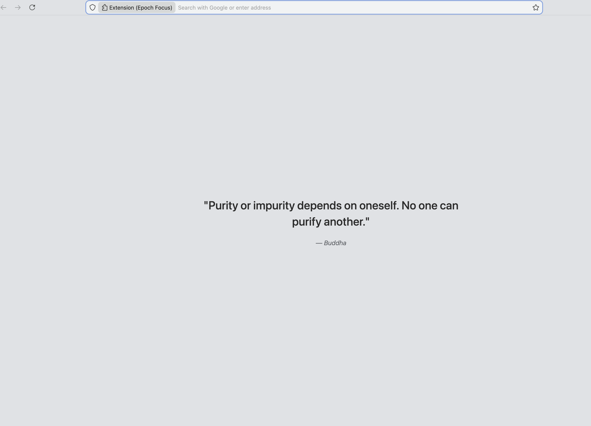
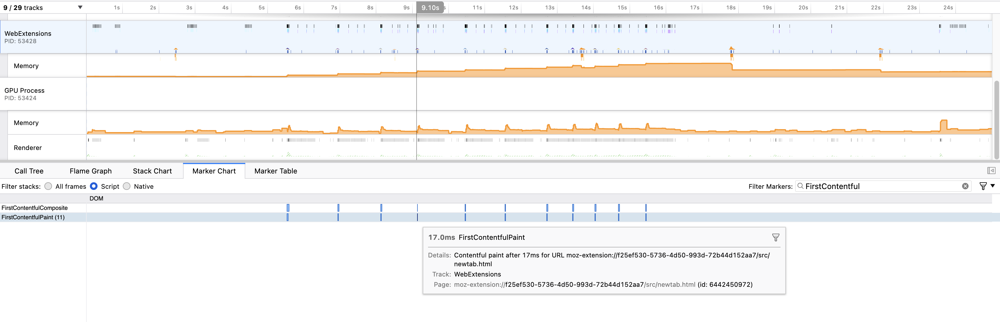
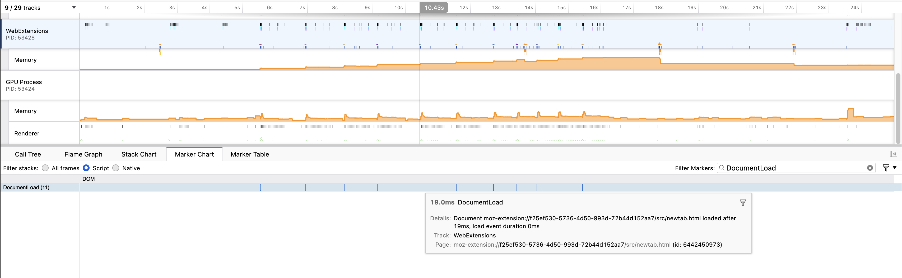
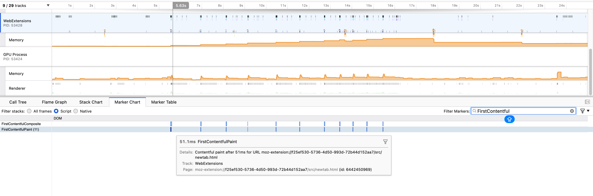

# Epoch Focus

**Epoch Focus** is a zero-latency "New Tab" override for Firefox. It replaces the noisy default homepage with a minimalist grey canvas and a single piece of Stoic wisdom.

Part of the **Epoch Suite** by [TheCSJourney](https://thecsjourney.com).



## The Philosophy
Standard "New Tab" extensions often load heavy frameworks (React/Vue) or fetch data from remote APIs, introducing 500ms+ latency.

Epoch Focus is engineered for **speed**, validated by Firefox Profiler:
- **Instant Paint:** Median First Contentful Paint of ~30ms.
- **No External Network:** Quotes and assets are bundled locally (no remote API calls).
- **Zero Layout Shift:** Uses system fonts to prevent flash-of-unstyled-text (FOUT).

## Performance Metrics
Benchmarks run on a fresh Firefox profile (n=11) confirm the architectural efficiency.

| Metric | Result | Context |
| :--- | :--- | :--- |
| **First Contentful Paint** | **17ms - 51ms** | Median: **30ms**. (60Hz = 16.6ms frame budget). |
| **Document Load** | **~19ms** | Total initialization overhead. |
| **Network Requests** | **0** | No external domains or telemetry. |

### The Proof (Trace Data)

*Figure 1: Best-case performance showing 17.0ms First Contentful Paint.*

<details>
<summary><strong> View Full Benchmark Suite (n=11 runs)</strong></summary>
<br>

**Document Load (~19ms)**

*Initialization overhead is consistently low.*

**Variance & Worst Case (Run #2)**

*Even the "worst case" (51ms) remains imperceptible to the user (Threshold <100ms).*

</details>

## Features
- **Stoic Database:** A hand-curated collection of Stoic and Eastern wisdom.
- **Visual Continuity:** Designed to align perfectly with the **Epoch Light** browser theme (`#E0E2E5`) to reduce contrast shock.
- **Privacy First:** No tracking, no analytics, no permissions required beyond storage.

## Installation

### The Epoch Suite (Recommended)
For the complete **high-performance environment**, install both components to align UI and functionality:

| Component | Install Link |
| :--- | :--- |
| **1. The Extension** | [](https://addons.mozilla.org/en-US/firefox/addon/epoch-focus/) |
| **2. The Theme** | [](https://addons.mozilla.org/en-US/firefox/addon/epoch-light/) |

### Local Installation (For Developers)
1. Download the latest release from [Releases](../../releases).
2. Go to `about:addons` -> ⚙️ -> **Install Add-on From File**.
3. Select the `.zip` file.

## Development
This project treats the extension as a software artifact with a reproducible build pipeline.

**Requirements:**
- Python 3.12+ (for build tools)
- `uv` (for dependency management)

**Build Pipeline:**
```bash
# 1. Generate high-fidelity icons using Lanczos resampling
uv run tools/generate_icons.py

# 2. Package the extension (Deterministic Zip)
uv run tools/build.py
```
---

*Built by [Sumit Nautiyal](https://thecsjourney.com)*
